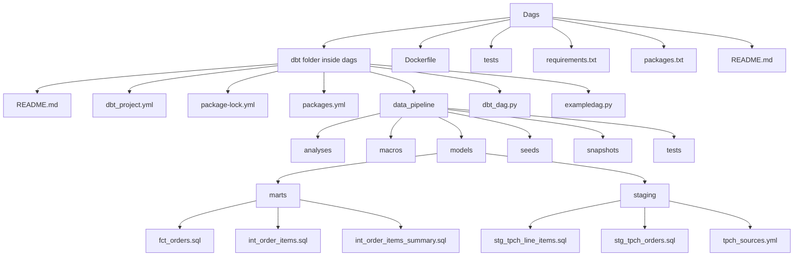

# ELT Pipeline using Snowflake

A modular data engineering project that combines Airflow DAGs with a dbt project to implement an ELT workflow on Snowflake. The repository organizes Airflow DAGs under the dags directory, with an embedded dbt project that models and tests data transformations.

## Architecture Overview

Note: This diagram shows top level directories and key files to give a quick overview of the project structure. It avoids including runtime specifics and focuses on the filesystem layout.

## Tech Stack

- Python (Airflow and general scripting)
- SQL (dbt models and tests)
- dbt with Snowflake adapter (dbt-snowflake)
- Snowflake (data warehouse)
- Docker (containerization)
- Astro Runtime / Astronomer ecosystem (as indicated by the Dockerfile and dependencies)
- YAML (dbt configurations and sources)

Dependencies are defined in requirements.txt, which includes:
- astronomer-cosmos
- apache-airflow-providers-snowflake

The Dockerfile installs dbt-snowflake inside a Python virtual environment.

## Getting Started / How to Run

The repository provides a Dockerfile and a requirements file. Use these to set up the environment.

Prerequisites
- Docker must be installed on your machine to build and run the Docker image.
- Optional: Python and virtual environment tooling if you want to run dependencies locally (not required if you exclusively use the Docker workflow).

What to run

- Build the Docker image (uses the provided Dockerfile)
  docker build -t elt_pipeline_snowflake -f Dockerfile .

- Run an interactive shell inside the built image
  docker run --rm -it elt_pipeline_snowflake bash

- Local development (optional, if you want to install dependencies without Docker)
  python3 -m venv venv
  source venv/bin/activate
  pip install --no-cache-dir -r requirements.txt

Notes
- The Dockerfile creates a Python virtual environment and installs dbt-snowflake inside it. There is no explicit application server or entrypoint defined in this image, so running a shell in the container is a straightforward way to inspect or interact with the environment.
- This project includes a sample test for a DAG under tests/dags/test_dag_example.py. To run tests locally, you would need a test runner such as pytest; the config shown here does not include test runner setup in the Dockerfile or requirements.txt beyond the listed dependencies.

## Project Structure

- dags/  
  - dbt/  
    - data_pipeline/  
      - analyses/ (dbt analyses)
      - macros/ (dbt macros, e.g., pricing.sql)
      - models/ (dbt models)
        - marts/ (dbt marts)
          - fct_orders.sql
          - generic_tests.yml
          - int_order_items.sql
          - int_order_items_summary.sql
        - staging/ (dbt staging)
          - stg_tpch_line_items.sql
          - stg_tpch_orders.sql
          - tpch_sources.yml
      - seeds/ (dbt seeds)
      - snapshots/ (dbt snapshots)
      - tests/ (dbt tests)
        - fact_orders_discount.sql
        - fct_orders_data_valid.sql
      - dbt_project.yml
      - package-lock.yml
      - packages.yml
      - README.md
  - dbt_dag.py
  - exampledag.py
- tests/  
  - dags/  
    - test_dag_example.py
- Dockerfile
- packages.txt
- README.md
- requirements.txt

Key directories briefly:
- dags: Main directory containing Airflow DAGs and a nested dbt project that integrates with Snowflake.
- tests: Test suite for DAGs and related components.
- Dockerfile: Image build instructions to provision the runtime environment with dbt-snowflake.
- requirements.txt: Python dependencies for the runtime (Airflow providers and related packages).
- packages.txt: Additional packaging or provider declarations used in the project context.

## Contributing

- Start by forking the repository and creating a feature branch.
- Ensure you follow conventional coding standards and keep changes focused.
- If you modify the dbt project or Airflow DAGs, update related tests and documentation as needed.
- Run local validation where possible:
  - Build the Docker image with the provided Dockerfile
  - Spin up an interactive container for quick checks
- Submit a pull request with a clear summary of changes and rationale.

For more detailed contribution guidelines, please add a CONTRIBUTING guide or feel free to open an issue to discuss proposed changes.